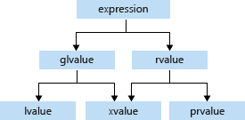

# К вопросу о копировании
Эта небольшая статья-исследование посвящена одной важной теме. касающейся языка C++ -- проблеме излишнего копирования и способам борьбы с ним. Излишнего копирования старались избегать всегда -- например, передавая объект в функцию по указателю или по ссылке, но ряд проблем так решить не удавалось. В частности, не очень эффективно копировать временные объекты, зная, что им, в общем-то, осталось жить всего ничего. Но для того, чтобы не быть голословными, нам нужен какой-нибудь инструмент для исследования.

## Tracker
Для этих целей была написана небольшая библиотека, которая позволяет отслеживать весь цикл жизни объекта, в том числе и копирования. Для того, чтобы использовать ее, необходимо вставить в методы класса (такие как конструкторы, операторы присваивания и деструктор) сигналы главному трекеру (инструменту, который занимается сбором информации) об интересном событии. В этой статье мы будем проводить исследования с использованием класса Int, который ведет себя как целое число (и является, конечно, оберткой над ним), поэтому в его методы вставлены необходимые сигналы. Например, копирующий конструктор выглядит так:
```c++
Int(Int const& a, std::string name = "") : 
        value(a.value)
    {
        Tracker::mainLogger.setName(info, name);
        info.value = std::to_string(value);
        info.address = this;
        Tracker::mainLogger.enterCtrCopy(info, a.info);
    }
```

После того, как отслеживаемый класс написан, с ним можно и поиграться. На самом деле mainLogger -- это всего лишь диспетчер, который пересылает информацию настоящим логгерам. Сделано это для того, чтобы лог можно было получать одновременно в разных форматах -- в виде консольного вывода, в HTML-файле или как граф. В функции `main` всегда будет вот такой 

Давайте попробуем сделать с Int'ами что-нибудь несложное, чтобы познакомиться с форматом вывода. Сразу скажу, что граф -- очень наглядная структура, но картинки занимают много места, поэтому в дальнейшем почти всюду я буду использовать текстовые логи.

Запустим такой код:
```cpp
Int extraCopyIncrement(Int copy)
{
    return copy++;
}

int main()
{
    TRACKER_DEFAULT_INITIALIZATION;
    TRACKER_ENTER;
    TRACKER_CREATE(Int, object, 0);
    TRACKER_CREATE(Int, returnValue, extraCopyIncrement(object));
}
```

Когда он отработает, в логах мы получим вот такой вывод:


<pre style = "background-color: #1e1e1e; color: #FFFFFF"><span class="inner-pre" style="font-size: 14px">
<b><font color=#f14c4c>Tracker log </font></b>generated on Tue Mar  8 23:26:04 2022


int main()
{
    <b><font color=#e5e5e5>CTR </font></b><b><font color=#f5f543>"object" </font></b>(id: <b><font color=#d670d6>0</font></b>, val: <b><font color=#d670d6>0</font></b>, addr: <b><font color=#d670d6>c053a490</font></b>)
    <b><font color=#f14c4c>COPY </font></b><b><font color=#f5f543>"tmp1" </font></b>(id: <b><font color=#d670d6>1</font></b>, val: <b><font color=#d670d6>0</font></b>, addr: <b><font color=#d670d6>c053a5d0</font></b>) from <b><font color=#f5f543>"object" </font></b>(id: <b><font color=#d670d6>0</font></b>, val: <b><font color=#d670d6>0</font></b>, addr: <b><font color=#d670d6>c053a490</font></b>)
    Int extraCopyIncrement(Int)
    {
        Int Int::operator++(int)
        {
            <b><font color=#f14c4c>COPY </font></b><b><font color=#f5f543>"currentValueCopy" </font></b>(id: <b><font color=#d670d6>2</font></b>, val: <b><font color=#d670d6>0</font></b>, addr: <b><font color=#d670d6>c053a340</font></b>) from <b><font color=#f5f543>"tmp1" </font></b>(id: <b><font color=#d670d6>1</font></b>, val: <b><font color=#d670d6>0</font></b>, addr: <b><font color=#d670d6>c053a5d0</font></b>)
            Int& Int::operator++()
            {
            }
            <b><font color=#f14c4c>COPY </font></b><b><font color=#f5f543>"tmp2" </font></b>(id: <b><font color=#d670d6>3</font></b>, val: <b><font color=#d670d6>0</font></b>, addr: <b><font color=#d670d6>c053a670</font></b>) from <b><font color=#f5f543>"currentValueCopy" </font></b>(id: <b><font color=#d670d6>2</font></b>, val: <b><font color=#d670d6>0</font></b>, addr: <b><font color=#d670d6>c053a340</font></b>)
            <b><font color=#3b8eea>DTR </font></b><b><font color=#f5f543>"currentValueCopy" </font></b>(id: <b><font color=#d670d6>2</font></b>, val: <b><font color=#d670d6>0</font></b>, addr: <b><font color=#d670d6>c053a340</font></b>)
        }
    }
    <b><font color=#f14c4c>COPY </font></b><b><font color=#f5f543>"returnValue" </font></b>(id: <b><font color=#d670d6>4</font></b>, val: <b><font color=#d670d6>0</font></b>, addr: <b><font color=#d670d6>c053a530</font></b>) from <b><font color=#f5f543>"tmp2" </font></b>(id: <b><font color=#d670d6>3</font></b>, val: <b><font color=#d670d6>0</font></b>, addr: <b><font color=#d670d6>c053a670</font></b>)
    <b><font color=#3b8eea>DTR </font></b><b><font color=#f5f543>"tmp2" </font></b>(id: <b><font color=#d670d6>3</font></b>, val: <b><font color=#d670d6>0</font></b>, addr: <b><font color=#d670d6>c053a670</font></b>)
    <b><font color=#3b8eea>DTR </font></b><b><font color=#f5f543>"tmp1" </font></b>(id: <b><font color=#d670d6>1</font></b>, val: <b><font color=#d670d6>0</font></b>, addr: <b><font color=#d670d6>c053a5d0</font></b>)
    <b><font color=#3b8eea>DTR </font></b><b><font color=#f5f543>"returnValue" </font></b>(id: <b><font color=#d670d6>4</font></b>, val: <b><font color=#d670d6>0</font></b>, addr: <b><font color=#d670d6>c053a530</font></b>)
    <b><font color=#3b8eea>DTR </font></b><b><font color=#f5f543>"object" </font></b>(id: <b><font color=#d670d6>0</font></b>, val: <b><font color=#d670d6>0</font></b>, addr: <b><font color=#d670d6>c053a490</font></b>)
}


5 objects created, 4 copied, 0 moved
</span></pre>


Отлично, как мы видим, при передаче `object` в функцию появился временный объект `tmp1` (который реально называется `copy`). Потом у `tmp1` вызывается постфиксный инкремент, внутри которого создается еще один временный объект `currentValueCopy`. При возвращении из этого инкремента `currentValueCopy` копируется в `tmp3`, а `tmp3` копируется в `returnValue` при выходе из `extraCopyIncrement`.

## Copy elision
Да... Надо признаться, уже здесь видно, что не все так хорошо. Зачем нужно это копирование сначала из `currentValueCopy` в `tmp2`, а потом из `tmp2` в `returnValue`. Неужели нельзя этого избежать?

Можно! Гениальные системные программисты придумали "copy elision" -- оптимизацию, которая удаляет лишние копирования. Если говорить точнее, то в данном случае нас интересует важнейшее её проявление "return value optimisation" (RVO). Смысл её заключается в том, что возвращаемое значение записывается прямо в конечный приемник без вызова лишних копирований. 

На самом деле, начиная со стандарта C++17, RVO относится к категории "Mandatory elision of copy/move operations", то есть к обязательным. Для того, чтобы показать, что происходит в её отсутствие, я насильно подавил эту оптимизацию с помощью флага `-fno-elide-constructors`. Давайте теперь вернём её обратно и посмотрим, что получилось:
<pre style = "background-color: #1e1e1e; color: #FFFFFF"><span class="inner-pre" style="font-size: 14px">
<b><font color=#f14c4c>Tracker log </font></b>generated on Wed Mar  9 00:47:01 2022


int main()
{
    <b><font color=#e5e5e5>CTR </font></b><b><font color=#f5f543>"object" </font></b>(id: <b><font color=#d670d6>0</font></b>, val: <b><font color=#d670d6>0</font></b>, addr: <b><font color=#d670d6>c9bcdd70</font></b>)
    <b><font color=#f14c4c>COPY </font></b><b><font color=#f5f543>"tmp1" </font></b>(id: <b><font color=#d670d6>1</font></b>, val: <b><font color=#d670d6>0</font></b>, addr: <b><font color=#d670d6>c9bcdeb0</font></b>) from <b><font color=#f5f543>"object" </font></b>(id: <b><font color=#d670d6>0</font></b>, val: <b><font color=#d670d6>0</font></b>, addr: <b><font color=#d670d6>c9bcdd70</font></b>)
    Int extraCopyIncrement(Int)
    {
        Int Int::operator++(int)
        {
            <b><font color=#f14c4c>COPY </font></b><b><font color=#f5f543>"currentValueCopy" </font></b>(id: <b><font color=#d670d6>2</font></b>, val: <b><font color=#d670d6>0</font></b>, addr: <b><font color=#d670d6>c9bcdf50</font></b>) from <b><font color=#f5f543>"tmp1" </font></b>(id: <b><font color=#d670d6>1</font></b>, val: <b><font color=#d670d6>0</font></b>, addr: <b><font color=#d670d6>c9bcdeb0</font></b>)
            Int& Int::operator++()
            {
            }
        }
    }
    <b><font color=#f14c4c>COPY </font></b><b><font color=#f5f543>"returnValue" </font></b>(id: <b><font color=#d670d6>3</font></b>, val: <b><font color=#d670d6>0</font></b>, addr: <b><font color=#d670d6>c9bcde10</font></b>) from <b><font color=#f5f543>"currentValueCopy" </font></b>(id: <b><font color=#d670d6>2</font></b>, val: <b><font color=#d670d6>0</font></b>, addr: <b><font color=#d670d6>c9bcdf50</font></b>)
    <b><font color=#3b8eea>DTR </font></b><b><font color=#f5f543>"currentValueCopy" </font></b>(id: <b><font color=#d670d6>2</font></b>, val: <b><font color=#d670d6>0</font></b>, addr: <b><font color=#d670d6>c9bcdf50</font></b>)
    <b><font color=#3b8eea>DTR </font></b><b><font color=#f5f543>"tmp1" </font></b>(id: <b><font color=#d670d6>1</font></b>, val: <b><font color=#d670d6>0</font></b>, addr: <b><font color=#d670d6>c9bcdeb0</font></b>)
    <b><font color=#3b8eea>DTR </font></b><b><font color=#f5f543>"returnValue" </font></b>(id: <b><font color=#d670d6>3</font></b>, val: <b><font color=#d670d6>0</font></b>, addr: <b><font color=#d670d6>c9bcde10</font></b>)
    <b><font color=#3b8eea>DTR </font></b><b><font color=#f5f543>"object" </font></b>(id: <b><font color=#d670d6>0</font></b>, val: <b><font color=#d670d6>0</font></b>, addr: <b><font color=#d670d6>c9bcdd70</font></b>)
}


4 objects created, 3 copied, 0 moved
</span></pre>

Так, теперь у нас на одно копирование меньше! Это хороший прогресс, но все-таки от копирования `currentValueCopy` в `returnValue` мы так и не избавились. Это логично, ведь в `Int Int::operator++(int)` сначала создается копия текущего состояния, а только потом вызывается оператор префиксного инкремента:

```cpp
Int operator++(int)
    {
        TRACKER_ENTER;
        TRACKER_CREATE(Int, currentValueCopy, *this);
        ++(*this);
        return currentValueCopy;
    }
```

Компилятор смог бы избежать этого копирования, если бы проследил, что все, зачем нужен объект `currentValueCopy` -- это просто быть возвращённым. Но, к сожалению, у него этого не получилось сделать((

Конечно, можно поправить код этого оператора, чтобы не создавать этой копии, ведь можно просто вернуть новый экземпляр `Int` с уменьшенным на один значением, тогда он, вероятно, создаст этот экземпляр прямо на месте `returnValue`. Давайте попробуем, вдруг у него теперь получится:

```cpp
Int operator++(int)
    {
        TRACKER_ENTER;
        ++(*this);
        return Int(value - 1);
    }
```

<pre style = "background-color: #1e1e1e; color: #FFFFFF"><span class="inner-pre" style="font-size: 14px">
<b><font color=#f14c4c>Tracker log </font></b>generated on Wed Mar  9 01:06:45 2022


int main()
{
    <b><font color=#e5e5e5>CTR </font></b><b><font color=#f5f543>"object" </font></b>(id: <b><font color=#d670d6>0</font></b>, val: <b><font color=#d670d6>0</font></b>, addr: <b><font color=#d670d6>aa138fc0</font></b>)
    <b><font color=#f14c4c>COPY </font></b><b><font color=#f5f543>"tmp1" </font></b>(id: <b><font color=#d670d6>1</font></b>, val: <b><font color=#d670d6>0</font></b>, addr: <b><font color=#d670d6>aa139100</font></b>) from <b><font color=#f5f543>"object" </font></b>(id: <b><font color=#d670d6>0</font></b>, val: <b><font color=#d670d6>0</font></b>, addr: <b><font color=#d670d6>aa138fc0</font></b>)
    Int extraCopyIncrement(Int)
    {
        Int Int::operator++(int)
        {
            Int& Int::operator++()
            {
            }
            <b><font color=#e5e5e5>CTR </font></b><b><font color=#f5f543>"tmp2" </font></b>(id: <b><font color=#d670d6>2</font></b>, val: <b><font color=#d670d6>0</font></b>, addr: <b><font color=#d670d6>aa1391a0</font></b>)
        }
    }
    <b><font color=#f14c4c>COPY </font></b><b><font color=#f5f543>"returnValue" </font></b>(id: <b><font color=#d670d6>3</font></b>, val: <b><font color=#d670d6>0</font></b>, addr: <b><font color=#d670d6>aa139060</font></b>) from <b><font color=#f5f543>"tmp2" </font></b>(id: <b><font color=#d670d6>2</font></b>, val: <b><font color=#d670d6>0</font></b>, addr: <b><font color=#d670d6>aa1391a0</font></b>)
    <b><font color=#3b8eea>DTR </font></b><b><font color=#f5f543>"tmp2" </font></b>(id: <b><font color=#d670d6>2</font></b>, val: <b><font color=#d670d6>0</font></b>, addr: <b><font color=#d670d6>aa1391a0</font></b>)
    <b><font color=#3b8eea>DTR </font></b><b><font color=#f5f543>"tmp1" </font></b>(id: <b><font color=#d670d6>1</font></b>, val: <b><font color=#d670d6>0</font></b>, addr: <b><font color=#d670d6>aa139100</font></b>)
    <b><font color=#3b8eea>DTR </font></b><b><font color=#f5f543>"returnValue" </font></b>(id: <b><font color=#d670d6>3</font></b>, val: <b><font color=#d670d6>0</font></b>, addr: <b><font color=#d670d6>aa139060</font></b>)
    <b><font color=#3b8eea>DTR </font></b><b><font color=#f5f543>"object" </font></b>(id: <b><font color=#d670d6>0</font></b>, val: <b><font color=#d670d6>0</font></b>, addr: <b><font color=#d670d6>aa138fc0</font></b>)
}


4 objects created, 2 copied, 0 moved
</span></pre>

Замечательно, мы избавились от одного копирования, заменив его на создание нового объекта! То есть наше предположение, что объект будет создан прямо на месте `returnValue`, не оправдалось. И слава Богу, ведь писать такой оператор инкремента -- это чудовищно)

Можно ещё немного поиграться с этой оптимизацией и попробовать понять: а важно ли, насколько глубоко из стека будет подниматься возвращаемое значение? Влияет ли это на работу оптимизации? Попробуем запустить вот такой код и посмотрим на вывод:
```cpp
Int level1()
{
    TRACKER_ENTER;
    return Int{};
}

Int level2()
{
    TRACKER_ENTER;
    return level1();
}

Int level3()
{
    TRACKER_ENTER;
    return level2();
}

int main()
{
    TRACKER_DEFAULT_INITIALIZATION;
    TRACKER_ENTER;
    TRACKER_CREATE(Int, returnValueLevel1, level1());
    TRACKER_CREATE(Int, returnValueLevel2, level2());
    TRACKER_CREATE(Int, returnValueLevel3, level3());
}
```
<pre style = "background-color: #1e1e1e; color: #FFFFFF"><span class="inner-pre" style="font-size: 14px">
<b><font color=#f14c4c>Tracker log </font></b>generated on Wed Mar  9 01:13:59 2022


int main()
{
    Int level1()
    {
        <b><font color=#e5e5e5>CTR </font></b><b><font color=#f5f543>"tmp1" </font></b>(id: <b><font color=#d670d6>0</font></b>, val: <b><font color=#d670d6>0</font></b>, addr: <b><font color=#d670d6>11f9e650</font></b>)
    }
    <b><font color=#f14c4c>COPY </font></b><b><font color=#f5f543>"returnValueLevel1" </font></b>(id: <b><font color=#d670d6>1</font></b>, val: <b><font color=#d670d6>0</font></b>, addr: <b><font color=#d670d6>11f9e470</font></b>) from <b><font color=#f5f543>"tmp1" </font></b>(id: <b><font color=#d670d6>0</font></b>, val: <b><font color=#d670d6>0</font></b>, addr: <b><font color=#d670d6>11f9e650</font></b>)
    <b><font color=#3b8eea>DTR </font></b><b><font color=#f5f543>"tmp1" </font></b>(id: <b><font color=#d670d6>0</font></b>, val: <b><font color=#d670d6>0</font></b>, addr: <b><font color=#d670d6>11f9e650</font></b>)
    Int level2()
    {
        Int level1()
        {
            <b><font color=#e5e5e5>CTR </font></b><b><font color=#f5f543>"tmp2" </font></b>(id: <b><font color=#d670d6>2</font></b>, val: <b><font color=#d670d6>0</font></b>, addr: <b><font color=#d670d6>11f9e650</font></b>)
        }
    }
    <b><font color=#f14c4c>COPY </font></b><b><font color=#f5f543>"returnValueLevel2" </font></b>(id: <b><font color=#d670d6>3</font></b>, val: <b><font color=#d670d6>0</font></b>, addr: <b><font color=#d670d6>11f9e510</font></b>) from <b><font color=#f5f543>"tmp2" </font></b>(id: <b><font color=#d670d6>2</font></b>, val: <b><font color=#d670d6>0</font></b>, addr: <b><font color=#d670d6>11f9e650</font></b>)
    <b><font color=#3b8eea>DTR </font></b><b><font color=#f5f543>"tmp2" </font></b>(id: <b><font color=#d670d6>2</font></b>, val: <b><font color=#d670d6>0</font></b>, addr: <b><font color=#d670d6>11f9e650</font></b>)
    Int level3()
    {
        Int level2()
        {
            Int level1()
            {
                <b><font color=#e5e5e5>CTR </font></b><b><font color=#f5f543>"tmp3" </font></b>(id: <b><font color=#d670d6>4</font></b>, val: <b><font color=#d670d6>0</font></b>, addr: <b><font color=#d670d6>11f9e650</font></b>)
            }
        }
    }
    <b><font color=#f14c4c>COPY </font></b><b><font color=#f5f543>"returnValueLevel3" </font></b>(id: <b><font color=#d670d6>5</font></b>, val: <b><font color=#d670d6>0</font></b>, addr: <b><font color=#d670d6>11f9e5b0</font></b>) from <b><font color=#f5f543>"tmp3" </font></b>(id: <b><font color=#d670d6>4</font></b>, val: <b><font color=#d670d6>0</font></b>, addr: <b><font color=#d670d6>11f9e650</font></b>)
    <b><font color=#3b8eea>DTR </font></b><b><font color=#f5f543>"tmp3" </font></b>(id: <b><font color=#d670d6>4</font></b>, val: <b><font color=#d670d6>0</font></b>, addr: <b><font color=#d670d6>11f9e650</font></b>)
    <b><font color=#3b8eea>DTR </font></b><b><font color=#f5f543>"returnValueLevel3" </font></b>(id: <b><font color=#d670d6>5</font></b>, val: <b><font color=#d670d6>0</font></b>, addr: <b><font color=#d670d6>11f9e5b0</font></b>)
    <b><font color=#3b8eea>DTR </font></b><b><font color=#f5f543>"returnValueLevel2" </font></b>(id: <b><font color=#d670d6>3</font></b>, val: <b><font color=#d670d6>0</font></b>, addr: <b><font color=#d670d6>11f9e510</font></b>)
    <b><font color=#3b8eea>DTR </font></b><b><font color=#f5f543>"returnValueLevel1" </font></b>(id: <b><font color=#d670d6>1</font></b>, val: <b><font color=#d670d6>0</font></b>, addr: <b><font color=#d670d6>11f9e470</font></b>)
}


6 objects created, 3 copied, 0 moved
</span></pre>

Как мы видим, компилятор не умеет создавать объект прямо на месте конечного хранилища, зато он может проследить, куда идет это возвращаемое значение, независимо от глубины рекурсии. Но внезапно при отключении RVO ничего не меняется! А если посмотреть на такой код?

```cpp
Int level1()
{
    TRACKER_ENTER;
    TRACKER_CREATE(Int, valueInLevel1, 0);
    return valueInLevel1;
}

Int level2()
{
    TRACKER_ENTER;
    TRACKER_CREATE(Int, valueInLevel2, level1());
    return valueInLevel2;
}

Int level3()
{
    TRACKER_ENTER;
    TRACKER_CREATE(Int, valueInLevel3, level2());
    return valueInLevel3;
}

int main()
{
    TRACKER_DEFAULT_INITIALIZATION;
    TRACKER_ENTER;
    TRACKER_CREATE(Int, returnValueLevel1, level1());
    TRACKER_CREATE(Int, returnValueLevel2, level2());
    TRACKER_CREATE(Int, returnValueLevel3, level3());
}
```

<pre style = "background-color: #1e1e1e; color: #FFFFFF"><span class="inner-pre" style="font-size: 14px">
<b><font color=#f14c4c>Tracker log </font></b>generated on Wed Mar  9 01:36:19 2022


int main()
{
    Int level1()
    {
        <b><font color=#e5e5e5>CTR </font></b><b><font color=#f5f543>"valueInLevel1" </font></b>(id: <b><font color=#d670d6>0</font></b>, val: <b><font color=#d670d6>0</font></b>, addr: <b><font color=#d670d6>1402c4b0</font></b>)
    }
    <b><font color=#f14c4c>COPY </font></b><b><font color=#f5f543>"returnValueLevel1" </font></b>(id: <b><font color=#d670d6>1</font></b>, val: <b><font color=#d670d6>0</font></b>, addr: <b><font color=#d670d6>1402c2d0</font></b>) from <b><font color=#f5f543>"valueInLevel1" </font></b>(id: <b><font color=#d670d6>0</font></b>, val: <b><font color=#d670d6>0</font></b>, addr: <b><font color=#d670d6>1402c4b0</font></b>)
    <b><font color=#3b8eea>DTR </font></b><b><font color=#f5f543>"valueInLevel1" </font></b>(id: <b><font color=#d670d6>0</font></b>, val: <b><font color=#d670d6>0</font></b>, addr: <b><font color=#d670d6>1402c4b0</font></b>)
    Int level2()
    {
        Int level1()
        {
            <b><font color=#e5e5e5>CTR </font></b><b><font color=#f5f543>"valueInLevel1" </font></b>(id: <b><font color=#d670d6>2</font></b>, val: <b><font color=#d670d6>0</font></b>, addr: <b><font color=#d670d6>1402c1b0</font></b>)
        }
        <b><font color=#f14c4c>COPY </font></b><b><font color=#f5f543>"valueInLevel2" </font></b>(id: <b><font color=#d670d6>3</font></b>, val: <b><font color=#d670d6>0</font></b>, addr: <b><font color=#d670d6>1402c4b0</font></b>) from <b><font color=#f5f543>"valueInLevel1" </font></b>(id: <b><font color=#d670d6>2</font></b>, val: <b><font color=#d670d6>0</font></b>, addr: <b><font color=#d670d6>1402c1b0</font></b>)
        <b><font color=#3b8eea>DTR </font></b><b><font color=#f5f543>"valueInLevel1" </font></b>(id: <b><font color=#d670d6>2</font></b>, val: <b><font color=#d670d6>0</font></b>, addr: <b><font color=#d670d6>1402c1b0</font></b>)
    }
    <b><font color=#f14c4c>COPY </font></b><b><font color=#f5f543>"returnValueLevel2" </font></b>(id: <b><font color=#d670d6>4</font></b>, val: <b><font color=#d670d6>0</font></b>, addr: <b><font color=#d670d6>1402c370</font></b>) from <b><font color=#f5f543>"valueInLevel2" </font></b>(id: <b><font color=#d670d6>3</font></b>, val: <b><font color=#d670d6>0</font></b>, addr: <b><font color=#d670d6>1402c4b0</font></b>)
    <b><font color=#3b8eea>DTR </font></b><b><font color=#f5f543>"valueInLevel2" </font></b>(id: <b><font color=#d670d6>3</font></b>, val: <b><font color=#d670d6>0</font></b>, addr: <b><font color=#d670d6>1402c4b0</font></b>)
    Int level3()
    {
        Int level2()
        {
            Int level1()
            {
                <b><font color=#e5e5e5>CTR </font></b><b><font color=#f5f543>"valueInLevel1" </font></b>(id: <b><font color=#d670d6>5</font></b>, val: <b><font color=#d670d6>0</font></b>, addr: <b><font color=#d670d6>1402c070</font></b>)
            }
            <b><font color=#f14c4c>COPY </font></b><b><font color=#f5f543>"valueInLevel2" </font></b>(id: <b><font color=#d670d6>6</font></b>, val: <b><font color=#d670d6>0</font></b>, addr: <b><font color=#d670d6>1402c1b0</font></b>) from <b><font color=#f5f543>"valueInLevel1" </font></b>(id: <b><font color=#d670d6>5</font></b>, val: <b><font color=#d670d6>0</font></b>, addr: <b><font color=#d670d6>1402c070</font></b>)
            <b><font color=#3b8eea>DTR </font></b><b><font color=#f5f543>"valueInLevel1" </font></b>(id: <b><font color=#d670d6>5</font></b>, val: <b><font color=#d670d6>0</font></b>, addr: <b><font color=#d670d6>1402c070</font></b>)
        }
        <b><font color=#f14c4c>COPY </font></b><b><font color=#f5f543>"valueInLevel3" </font></b>(id: <b><font color=#d670d6>7</font></b>, val: <b><font color=#d670d6>0</font></b>, addr: <b><font color=#d670d6>1402c4b0</font></b>) from <b><font color=#f5f543>"valueInLevel2" </font></b>(id: <b><font color=#d670d6>6</font></b>, val: <b><font color=#d670d6>0</font></b>, addr: <b><font color=#d670d6>1402c1b0</font></b>)
        <b><font color=#3b8eea>DTR </font></b><b><font color=#f5f543>"valueInLevel2" </font></b>(id: <b><font color=#d670d6>6</font></b>, val: <b><font color=#d670d6>0</font></b>, addr: <b><font color=#d670d6>1402c1b0</font></b>)
    }
    <b><font color=#f14c4c>COPY </font></b><b><font color=#f5f543>"returnValueLevel3" </font></b>(id: <b><font color=#d670d6>8</font></b>, val: <b><font color=#d670d6>0</font></b>, addr: <b><font color=#d670d6>1402c410</font></b>) from <b><font color=#f5f543>"valueInLevel3" </font></b>(id: <b><font color=#d670d6>7</font></b>, val: <b><font color=#d670d6>0</font></b>, addr: <b><font color=#d670d6>1402c4b0</font></b>)
    <b><font color=#3b8eea>DTR </font></b><b><font color=#f5f543>"valueInLevel3" </font></b>(id: <b><font color=#d670d6>7</font></b>, val: <b><font color=#d670d6>0</font></b>, addr: <b><font color=#d670d6>1402c4b0</font></b>)
    <b><font color=#3b8eea>DTR </font></b><b><font color=#f5f543>"returnValueLevel3" </font></b>(id: <b><font color=#d670d6>8</font></b>, val: <b><font color=#d670d6>0</font></b>, addr: <b><font color=#d670d6>1402c410</font></b>)
    <b><font color=#3b8eea>DTR </font></b><b><font color=#f5f543>"returnValueLevel2" </font></b>(id: <b><font color=#d670d6>4</font></b>, val: <b><font color=#d670d6>0</font></b>, addr: <b><font color=#d670d6>1402c370</font></b>)
    <b><font color=#3b8eea>DTR </font></b><b><font color=#f5f543>"returnValueLevel1" </font></b>(id: <b><font color=#d670d6>1</font></b>, val: <b><font color=#d670d6>0</font></b>, addr: <b><font color=#d670d6>1402c2d0</font></b>)
}


9 objects created, 6 copied, 0 moved
</span></pre>

Кажется, что RVO справляется не очень хорошо с такими проблемами... Но в отсутствие этой оптимизации все было бы еще хуже:
<pre style = "background-color: #1e1e1e; color: #FFFFFF"><span class="inner-pre" style="font-size: 14px">
<b><font color=#f14c4c>Tracker log </font></b>generated on Wed Mar  9 01:40:17 2022


int main()
{
    Int level1()
    {
        <b><font color=#e5e5e5>CTR </font></b><b><font color=#f5f543>"valueInLevel1" </font></b>(id: <b><font color=#d670d6>0</font></b>, val: <b><font color=#d670d6>0</font></b>, addr: <b><font color=#d670d6>50d2ae60</font></b>)
        <b><font color=#f14c4c>COPY </font></b><b><font color=#f5f543>"tmp1" </font></b>(id: <b><font color=#d670d6>1</font></b>, val: <b><font color=#d670d6>0</font></b>, addr: <b><font color=#d670d6>50d2b150</font></b>) from <b><font color=#f5f543>"valueInLevel1" </font></b>(id: <b><font color=#d670d6>0</font></b>, val: <b><font color=#d670d6>0</font></b>, addr: <b><font color=#d670d6>50d2ae60</font></b>)
        <b><font color=#3b8eea>DTR </font></b><b><font color=#f5f543>"valueInLevel1" </font></b>(id: <b><font color=#d670d6>0</font></b>, val: <b><font color=#d670d6>0</font></b>, addr: <b><font color=#d670d6>50d2ae60</font></b>)
    }
    <b><font color=#f14c4c>COPY </font></b><b><font color=#f5f543>"returnValueLevel1" </font></b>(id: <b><font color=#d670d6>2</font></b>, val: <b><font color=#d670d6>0</font></b>, addr: <b><font color=#d670d6>50d2af70</font></b>) from <b><font color=#f5f543>"tmp1" </font></b>(id: <b><font color=#d670d6>1</font></b>, val: <b><font color=#d670d6>0</font></b>, addr: <b><font color=#d670d6>50d2b150</font></b>)
    <b><font color=#3b8eea>DTR </font></b><b><font color=#f5f543>"tmp1" </font></b>(id: <b><font color=#d670d6>1</font></b>, val: <b><font color=#d670d6>0</font></b>, addr: <b><font color=#d670d6>50d2b150</font></b>)
    Int level2()
    {
        Int level1()
        {
            <b><font color=#e5e5e5>CTR </font></b><b><font color=#f5f543>"valueInLevel1" </font></b>(id: <b><font color=#d670d6>3</font></b>, val: <b><font color=#d670d6>0</font></b>, addr: <b><font color=#d670d6>50d2ac50</font></b>)
            <b><font color=#f14c4c>COPY </font></b><b><font color=#f5f543>"tmp2" </font></b>(id: <b><font color=#d670d6>4</font></b>, val: <b><font color=#d670d6>0</font></b>, addr: <b><font color=#d670d6>50d2ae60</font></b>) from <b><font color=#f5f543>"valueInLevel1" </font></b>(id: <b><font color=#d670d6>3</font></b>, val: <b><font color=#d670d6>0</font></b>, addr: <b><font color=#d670d6>50d2ac50</font></b>)
            <b><font color=#3b8eea>DTR </font></b><b><font color=#f5f543>"valueInLevel1" </font></b>(id: <b><font color=#d670d6>3</font></b>, val: <b><font color=#d670d6>0</font></b>, addr: <b><font color=#d670d6>50d2ac50</font></b>)
        }
        <b><font color=#f14c4c>COPY </font></b><b><font color=#f5f543>"valueInLevel2" </font></b>(id: <b><font color=#d670d6>5</font></b>, val: <b><font color=#d670d6>0</font></b>, addr: <b><font color=#d670d6>50d2adc0</font></b>) from <b><font color=#f5f543>"tmp2" </font></b>(id: <b><font color=#d670d6>4</font></b>, val: <b><font color=#d670d6>0</font></b>, addr: <b><font color=#d670d6>50d2ae60</font></b>)
        <b><font color=#3b8eea>DTR </font></b><b><font color=#f5f543>"tmp2" </font></b>(id: <b><font color=#d670d6>4</font></b>, val: <b><font color=#d670d6>0</font></b>, addr: <b><font color=#d670d6>50d2ae60</font></b>)
        <b><font color=#f14c4c>COPY </font></b><b><font color=#f5f543>"tmp3" </font></b>(id: <b><font color=#d670d6>6</font></b>, val: <b><font color=#d670d6>0</font></b>, addr: <b><font color=#d670d6>50d2b150</font></b>) from <b><font color=#f5f543>"valueInLevel2" </font></b>(id: <b><font color=#d670d6>5</font></b>, val: <b><font color=#d670d6>0</font></b>, addr: <b><font color=#d670d6>50d2adc0</font></b>)
        <b><font color=#3b8eea>DTR </font></b><b><font color=#f5f543>"valueInLevel2" </font></b>(id: <b><font color=#d670d6>5</font></b>, val: <b><font color=#d670d6>0</font></b>, addr: <b><font color=#d670d6>50d2adc0</font></b>)
    }
    <b><font color=#f14c4c>COPY </font></b><b><font color=#f5f543>"returnValueLevel2" </font></b>(id: <b><font color=#d670d6>7</font></b>, val: <b><font color=#d670d6>0</font></b>, addr: <b><font color=#d670d6>50d2b010</font></b>) from <b><font color=#f5f543>"tmp3" </font></b>(id: <b><font color=#d670d6>6</font></b>, val: <b><font color=#d670d6>0</font></b>, addr: <b><font color=#d670d6>50d2b150</font></b>)
    <b><font color=#3b8eea>DTR </font></b><b><font color=#f5f543>"tmp3" </font></b>(id: <b><font color=#d670d6>6</font></b>, val: <b><font color=#d670d6>0</font></b>, addr: <b><font color=#d670d6>50d2b150</font></b>)
    Int level3()
    {
        Int level2()
        {
            Int level1()
            {
                <b><font color=#e5e5e5>CTR </font></b><b><font color=#f5f543>"valueInLevel1" </font></b>(id: <b><font color=#d670d6>8</font></b>, val: <b><font color=#d670d6>0</font></b>, addr: <b><font color=#d670d6>50d2aa40</font></b>)
                <b><font color=#f14c4c>COPY </font></b><b><font color=#f5f543>"tmp4" </font></b>(id: <b><font color=#d670d6>9</font></b>, val: <b><font color=#d670d6>0</font></b>, addr: <b><font color=#d670d6>50d2ac50</font></b>) from <b><font color=#f5f543>"valueInLevel1" </font></b>(id: <b><font color=#d670d6>8</font></b>, val: <b><font color=#d670d6>0</font></b>, addr: <b><font color=#d670d6>50d2aa40</font></b>)
                <b><font color=#3b8eea>DTR </font></b><b><font color=#f5f543>"valueInLevel1" </font></b>(id: <b><font color=#d670d6>8</font></b>, val: <b><font color=#d670d6>0</font></b>, addr: <b><font color=#d670d6>50d2aa40</font></b>)
            }
            <b><font color=#f14c4c>COPY </font></b><b><font color=#f5f543>"valueInLevel2" </font></b>(id: <b><font color=#d670d6>10</font></b>, val: <b><font color=#d670d6>0</font></b>, addr: <b><font color=#d670d6>50d2abb0</font></b>) from <b><font color=#f5f543>"tmp4" </font></b>(id: <b><font color=#d670d6>9</font></b>, val: <b><font color=#d670d6>0</font></b>, addr: <b><font color=#d670d6>50d2ac50</font></b>)
            <b><font color=#3b8eea>DTR </font></b><b><font color=#f5f543>"tmp4" </font></b>(id: <b><font color=#d670d6>9</font></b>, val: <b><font color=#d670d6>0</font></b>, addr: <b><font color=#d670d6>50d2ac50</font></b>)
            <b><font color=#f14c4c>COPY </font></b><b><font color=#f5f543>"tmp5" </font></b>(id: <b><font color=#d670d6>11</font></b>, val: <b><font color=#d670d6>0</font></b>, addr: <b><font color=#d670d6>50d2ae60</font></b>) from <b><font color=#f5f543>"valueInLevel2" </font></b>(id: <b><font color=#d670d6>10</font></b>, val: <b><font color=#d670d6>0</font></b>, addr: <b><font color=#d670d6>50d2abb0</font></b>)
            <b><font color=#3b8eea>DTR </font></b><b><font color=#f5f543>"valueInLevel2" </font></b>(id: <b><font color=#d670d6>10</font></b>, val: <b><font color=#d670d6>0</font></b>, addr: <b><font color=#d670d6>50d2abb0</font></b>)
        }
        <b><font color=#f14c4c>COPY </font></b><b><font color=#f5f543>"valueInLevel3" </font></b>(id: <b><font color=#d670d6>12</font></b>, val: <b><font color=#d670d6>0</font></b>, addr: <b><font color=#d670d6>50d2adc0</font></b>) from <b><font color=#f5f543>"tmp5" </font></b>(id: <b><font color=#d670d6>11</font></b>, val: <b><font color=#d670d6>0</font></b>, addr: <b><font color=#d670d6>50d2ae60</font></b>)
        <b><font color=#3b8eea>DTR </font></b><b><font color=#f5f543>"tmp5" </font></b>(id: <b><font color=#d670d6>11</font></b>, val: <b><font color=#d670d6>0</font></b>, addr: <b><font color=#d670d6>50d2ae60</font></b>)
        <b><font color=#f14c4c>COPY </font></b><b><font color=#f5f543>"tmp6" </font></b>(id: <b><font color=#d670d6>13</font></b>, val: <b><font color=#d670d6>0</font></b>, addr: <b><font color=#d670d6>50d2b150</font></b>) from <b><font color=#f5f543>"valueInLevel3" </font></b>(id: <b><font color=#d670d6>12</font></b>, val: <b><font color=#d670d6>0</font></b>, addr: <b><font color=#d670d6>50d2adc0</font></b>)
        <b><font color=#3b8eea>DTR </font></b><b><font color=#f5f543>"valueInLevel3" </font></b>(id: <b><font color=#d670d6>12</font></b>, val: <b><font color=#d670d6>0</font></b>, addr: <b><font color=#d670d6>50d2adc0</font></b>)
    }
    <b><font color=#f14c4c>COPY </font></b><b><font color=#f5f543>"returnValueLevel3" </font></b>(id: <b><font color=#d670d6>14</font></b>, val: <b><font color=#d670d6>0</font></b>, addr: <b><font color=#d670d6>50d2b0b0</font></b>) from <b><font color=#f5f543>"tmp6" </font></b>(id: <b><font color=#d670d6>13</font></b>, val: <b><font color=#d670d6>0</font></b>, addr: <b><font color=#d670d6>50d2b150</font></b>)
    <b><font color=#3b8eea>DTR </font></b><b><font color=#f5f543>"tmp6" </font></b>(id: <b><font color=#d670d6>13</font></b>, val: <b><font color=#d670d6>0</font></b>, addr: <b><font color=#d670d6>50d2b150</font></b>)
    <b><font color=#3b8eea>DTR </font></b><b><font color=#f5f543>"returnValueLevel3" </font></b>(id: <b><font color=#d670d6>14</font></b>, val: <b><font color=#d670d6>0</font></b>, addr: <b><font color=#d670d6>50d2b0b0</font></b>)
    <b><font color=#3b8eea>DTR </font></b><b><font color=#f5f543>"returnValueLevel2" </font></b>(id: <b><font color=#d670d6>7</font></b>, val: <b><font color=#d670d6>0</font></b>, addr: <b><font color=#d670d6>50d2b010</font></b>)
    <b><font color=#3b8eea>DTR </font></b><b><font color=#f5f543>"returnValueLevel1" </font></b>(id: <b><font color=#d670d6>2</font></b>, val: <b><font color=#d670d6>0</font></b>, addr: <b><font color=#d670d6>50d2af70</font></b>)
}


15 objects created, 12 copied, 0 moved
</span></pre>

Как можно заметить, количество копирований увеличилось в два раза. Без этой оптимизации при каждом возврате из функции создается временный объект `tmp...`, который потом копируется в именованный объект и приказывает долго жить.

Поэтому можно сделать такой **вывод: RVO является очень полезной оптимизацией, которая в некоторых случаях значительно снижает количество лишних копирований без нашего вмешательства, но её явно недостаточно, чтобы убрать лишние копирования.** Необходим ещё какой-нибудь механизм!

## Move-семантика
Честно говоря, Int выступает не очень хорошим примером для этой проблемы: копирование Int\`a достаточно дешевая операция, чтобы можно было успокоиться и не лезть дальше. Поэтому давайте временно представим, что мы имеем дело с каким-нибудь контейнером, например, аналогом `std::string`:
```cpp
class String
{
public:
    String(String const& string) :
        size_(string.size_),
        data_(new char[size_]) //, ...
    {
        for (size_t idx = 0; string.data_[idx]; idx++)
            data_[idx] = string.data_[idx];

        data_[size_] = '\0';
    }
    // Другие конструкторы и разнообразные полезные функции

protected:
    size_t size_;
    char* data_;
    // Еще какие-нибудь полезные поля и методы
};
```

Я намеренно написал в теле конструктора копирования явный `for` вместо вызова `strcpy`, чтобы это посимвольное копирование не было скрытым. В отличие от `Int`, копирование `String` -- это не одна маленькая инструкция присваивания, это цикл, который для больших строк может стать очень и очень длительным. Но даже для достаточно небольших строк, скажем, символов 20, это очень затратная операция, потому что люди, пишущие прикладной код, редко хотят задумываться "а сколько же я сейчас породил временных объектов? Не стоит ли мне передать здесь эту строку по значению, а тут заменить сложение конкатенацией?". Поэтому желательно избегать ненужного копирования хотя бы автоматически.

К сожалению, как мы уже выяснили, совсем без нашей помощи компилятор обойтись не может. Но зато он умеет понимать, что такое rvalue и lvalue.

### Rvalue/lvalue
Выражения могут иметь разные категории: например, какие-то могут стоять слева от знака присваивания, а какие-то нет. Стандарт определяет разные категории так:
* A glvalue is an expression whose evaluation determines the identity of an object, bit-field, or function.
* A prvalue is an expression whose evaluation initializes an object or a bit-field, or computes the value of the operand of an operator, as specified by the context in which it appears.
* An xvalue is a glvalue that denotes an object or bit-field whose resources can be reused (usually because it is near the end of its lifetime). Example: Certain kinds of expressions involving rvalue references (8.3.2) yield xvalues, such as a call to a function whose return type is an rvalue reference or a cast to an rvalue reference type.
* An lvalue is a glvalue that is not an xvalue.
* An rvalue is a prvalue or an xvalue.



Замечательное определение и замечательная картинка, но лучше их пояснить несколько другим способом. Как можно видеть, на нижнем уровне у нас есть три категории выражений, из которых строятся другие: lvalue, xvalue и prvalue.
* lvalue *имеет адрес*, который можно будет далее использовать в программе. Например, это имена переменных (в том числе константных), элементы массива, вызов функции, возвращающей ссылку и др.
* prvalue *не имеет адреса*, к которому можно обратиться. Примерами могут выступать литералы (никогда не задумывались, чему может быть равно `&5`?), временные объекты, которые получаются при вычислении выражения и вызов функции, которая не возвращает ссылку.
* xvalue *имеет адрес, который, возможно, вот-вот перестанет быть валидным, но его еще можно использовать*. Пока что совсем не ясно даже, какие можно тут привести примеры, но в дальнейшем они появятся.

### Rvalue ссылка
Внимание, вопрос: зачем нам нужна эта информация? Дело в том, что компилятор умеет понимать, что какое-то выражение является rvalue. А значит, для этих rvalue можно соорудить какой-нибудь особый конструктор, который будет вызываться вместо копирующего. Но для этого нам нужен способ отделять эти конструкторы друг от друга. Решение, которое придумали при разработке стандарта 2011 года, называется "давайте введём ссылку на rvalue!". Честно говоря, мне не нравится такое название, потому что, по крайней мере, в моей голове ссылка представляется как автоматически разыменовываемый указатель, а что такое указатель, например, на литерал, никто не знает. Но предложить более подходящее название я тоже, к сожалению, не могу, поэтому оставим такое, какое есть)

Ссылка на rvalue обозначается двумя амперсандами, типа такого:
```cpp
T&& rvalueRef = foo();
```

Соответственно, новый легковесный конструктор запишется так:
```cpp
String::String(String&& string);
```

Но в чем от него толк, как его можно использовать?

### Перемещение
А толк весьма большой. Если вы помните, ужас копирования заключается в том, что надо каждый раз создавать новый (огромный) буфер и посимвольно туда копировать предыдущую строчку. Но если мы знаем, что к нам пришел объект типа rvalue, то мы понимаем, что ему осталось жить не долго. Так зачем с ним церемониться и пытаться оставить его в таком же состоянии, тратя время на копирование? Давайте просто его обворуем!

```cpp
String::String(String&& string) :
    size_(string.size_),
    data_(string.data_) //, ...
{
    // Хоть мы его и обворовываем, оставить
    // объект в несогласованном состоянии мы не можем,
    // потому что при его смерти вызовется деструктор и
    // положит всю программу. Точно также мы не хотим
    // оставить у него его данные, потому что тогда это
    // будет просто неглубокое копирование, и когда он умрет,
    // наш буфер data_ будет очищен тоже, а мы этого не хотим!
    string.data_ = nullptr;
    string.size_ = 0;
}
```

В этом и есть смысл **перемещения** -- переместить все полезное к себе. Оно гораздо дешевле копирования, поэтому в его присутствии жизнь становится веселее. Теперь те копирования, которые мы не смогли убрать посредством copy elision, будут обращены в перемещение, что не может не радовать.

Давайте добавим в наш Int перемещающий конструктор, чтобы убедиться, что он вызывается там, где надо, и вернемся к предыдущему примеру сразу со включенным RVO. Напомню, что код выглядел так:
```cpp
Int level1()
{
    TRACKER_ENTER;
    TRACKER_CREATE(Int, valueInLevel1, 0);
    return valueInLevel1;
}

Int level2()
{
    TRACKER_ENTER;
    TRACKER_CREATE(Int, valueInLevel2, level1());
    return valueInLevel2;
}

Int level3()
{
    TRACKER_ENTER;
    TRACKER_CREATE(Int, valueInLevel3, level2());
    return valueInLevel3;
}

int main()
{
    TRACKER_DEFAULT_INITIALIZATION;
    TRACKER_ENTER;
    TRACKER_CREATE(Int, returnValueLevel1, level1());
    TRACKER_CREATE(Int, returnValueLevel2, level2());
    TRACKER_CREATE(Int, returnValueLevel3, level3());
}
```
Выхлоп трекера будет теперь таким:
<pre style = "background-color: #1e1e1e; color: #FFFFFF"><span class="inner-pre" style="font-size: 14px">
<b><font color=#f14c4c>Tracker log </font></b>generated on Wed Mar  9 03:16:25 2022


int main()
{
    Int level1()
    {
        <b><font color=#e5e5e5>CTR </font></b><b><font color=#f5f543>"valueInLevel1" </font></b>(id: <b><font color=#d670d6>0</font></b>, val: <b><font color=#d670d6>0</font></b>, addr: <b><font color=#d670d6>b4bacab0</font></b>)
    }
    <b><font color=#23d18b>MOVE </font></b><b><font color=#f5f543>"returnValueLevel1" </font></b>(id: <b><font color=#d670d6>1</font></b>, val: <b><font color=#d670d6>0</font></b>, addr: <b><font color=#d670d6>b4bac8d0</font></b>) from <b><font color=#f5f543>"valueInLevel1" </font></b>(id: <b><font color=#d670d6>0</font></b>, val: <b><font color=#d670d6>0</font></b>, addr: <b><font color=#d670d6>b4bacab0</font></b>)
    <b><font color=#3b8eea>DTR </font></b><b><font color=#f5f543>"valueInLevel1" </font></b>(id: <b><font color=#d670d6>0</font></b>, val: <b><font color=#d670d6>0</font></b>, addr: <b><font color=#d670d6>b4bacab0</font></b>)
    Int level2()
    {
        Int level1()
        {
            <b><font color=#e5e5e5>CTR </font></b><b><font color=#f5f543>"valueInLevel1" </font></b>(id: <b><font color=#d670d6>2</font></b>, val: <b><font color=#d670d6>0</font></b>, addr: <b><font color=#d670d6>b4bac7b0</font></b>)
        }
        <b><font color=#23d18b>MOVE </font></b><b><font color=#f5f543>"valueInLevel2" </font></b>(id: <b><font color=#d670d6>3</font></b>, val: <b><font color=#d670d6>0</font></b>, addr: <b><font color=#d670d6>b4bacab0</font></b>) from <b><font color=#f5f543>"valueInLevel1" </font></b>(id: <b><font color=#d670d6>2</font></b>, val: <b><font color=#d670d6>0</font></b>, addr: <b><font color=#d670d6>b4bac7b0</font></b>)
        <b><font color=#3b8eea>DTR </font></b><b><font color=#f5f543>"valueInLevel1" </font></b>(id: <b><font color=#d670d6>2</font></b>, val: <b><font color=#d670d6>0</font></b>, addr: <b><font color=#d670d6>b4bac7b0</font></b>)
    }
    <b><font color=#23d18b>MOVE </font></b><b><font color=#f5f543>"returnValueLevel2" </font></b>(id: <b><font color=#d670d6>4</font></b>, val: <b><font color=#d670d6>0</font></b>, addr: <b><font color=#d670d6>b4bac970</font></b>) from <b><font color=#f5f543>"valueInLevel2" </font></b>(id: <b><font color=#d670d6>3</font></b>, val: <b><font color=#d670d6>0</font></b>, addr: <b><font color=#d670d6>b4bacab0</font></b>)
    <b><font color=#3b8eea>DTR </font></b><b><font color=#f5f543>"valueInLevel2" </font></b>(id: <b><font color=#d670d6>3</font></b>, val: <b><font color=#d670d6>0</font></b>, addr: <b><font color=#d670d6>b4bacab0</font></b>)
    Int level3()
    {
        Int level2()
        {
            Int level1()
            {
                <b><font color=#e5e5e5>CTR </font></b><b><font color=#f5f543>"valueInLevel1" </font></b>(id: <b><font color=#d670d6>5</font></b>, val: <b><font color=#d670d6>0</font></b>, addr: <b><font color=#d670d6>b4bac670</font></b>)
            }
            <b><font color=#23d18b>MOVE </font></b><b><font color=#f5f543>"valueInLevel2" </font></b>(id: <b><font color=#d670d6>6</font></b>, val: <b><font color=#d670d6>0</font></b>, addr: <b><font color=#d670d6>b4bac7b0</font></b>) from <b><font color=#f5f543>"valueInLevel1" </font></b>(id: <b><font color=#d670d6>5</font></b>, val: <b><font color=#d670d6>0</font></b>, addr: <b><font color=#d670d6>b4bac670</font></b>)
            <b><font color=#3b8eea>DTR </font></b><b><font color=#f5f543>"valueInLevel1" </font></b>(id: <b><font color=#d670d6>5</font></b>, val: <b><font color=#d670d6>0</font></b>, addr: <b><font color=#d670d6>b4bac670</font></b>)
        }
        <b><font color=#23d18b>MOVE </font></b><b><font color=#f5f543>"valueInLevel3" </font></b>(id: <b><font color=#d670d6>7</font></b>, val: <b><font color=#d670d6>0</font></b>, addr: <b><font color=#d670d6>b4bacab0</font></b>) from <b><font color=#f5f543>"valueInLevel2" </font></b>(id: <b><font color=#d670d6>6</font></b>, val: <b><font color=#d670d6>0</font></b>, addr: <b><font color=#d670d6>b4bac7b0</font></b>)
        <b><font color=#3b8eea>DTR </font></b><b><font color=#f5f543>"valueInLevel2" </font></b>(id: <b><font color=#d670d6>6</font></b>, val: <b><font color=#d670d6>0</font></b>, addr: <b><font color=#d670d6>b4bac7b0</font></b>)
    }
    <b><font color=#23d18b>MOVE </font></b><b><font color=#f5f543>"returnValueLevel3" </font></b>(id: <b><font color=#d670d6>8</font></b>, val: <b><font color=#d670d6>0</font></b>, addr: <b><font color=#d670d6>b4baca10</font></b>) from <b><font color=#f5f543>"valueInLevel3" </font></b>(id: <b><font color=#d670d6>7</font></b>, val: <b><font color=#d670d6>0</font></b>, addr: <b><font color=#d670d6>b4bacab0</font></b>)
    <b><font color=#3b8eea>DTR </font></b><b><font color=#f5f543>"valueInLevel3" </font></b>(id: <b><font color=#d670d6>7</font></b>, val: <b><font color=#d670d6>0</font></b>, addr: <b><font color=#d670d6>b4bacab0</font></b>)
    <b><font color=#3b8eea>DTR </font></b><b><font color=#f5f543>"returnValueLevel3" </font></b>(id: <b><font color=#d670d6>8</font></b>, val: <b><font color=#d670d6>0</font></b>, addr: <b><font color=#d670d6>b4baca10</font></b>)
    <b><font color=#3b8eea>DTR </font></b><b><font color=#f5f543>"returnValueLevel2" </font></b>(id: <b><font color=#d670d6>4</font></b>, val: <b><font color=#d670d6>0</font></b>, addr: <b><font color=#d670d6>b4bac970</font></b>)
    <b><font color=#3b8eea>DTR </font></b><b><font color=#f5f543>"returnValueLevel1" </font></b>(id: <b><font color=#d670d6>1</font></b>, val: <b><font color=#d670d6>0</font></b>, addr: <b><font color=#d670d6>b4bac8d0</font></b>)
}


9 objects created, 0 copied, 6 moved
</span></pre>

Ура! Зелёненькие надписи MOVE говорят нам о том, что все те красные копирования были лишними и компилятор смог заменить их на дешёвое перемещения. Но может, теперь RVO не нужно совсем? Является ли семантика перемещения обобщением copy elision?

**Нет!** RVO и семантика перемещения -- это ортогональные вещи, которые никак не пересекаются. Если отключить RVO, то последняя строчка со статистикой будет такой:
<pre style = "background-color: #1e1e1e; color: #FFFFFF"><span class="inner-pre" style="font-size: 14px">15 objects created, 0 copied, 12 moved</span></pre>

Конечно, 6 дополнительных перемещений это не 6 дополнительных копирований, но всё-таки 6 лишних объектов -- это как минимум 6 лишних вызовов деструктора. Глубокая мысль. В любом случае, copy elision не теряет своего значения даже в присутствии перемещающих конструкторов. Отсюда два вывода: во-первых, **разделение выражений на категории позволяет построить новые перемещающие конструкторы, работа которых может оказаться значительно более дешёвой, нежели глубокое копирование.** А во-вторых, **семантика перемещения и RVO -- это взаимно дополняющие приемы, но не покрывающие один другой.**

## std::move
